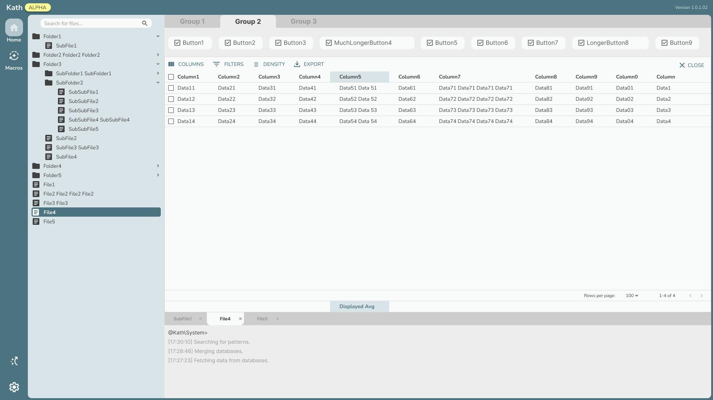
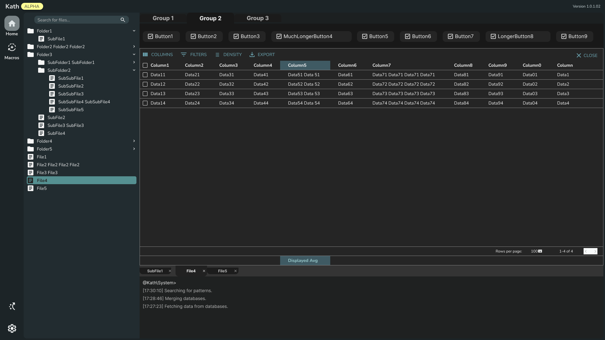

---

### 📖 Project Overview

**kath** is a user-friendly GUI tool designed for the in-depth analysis of gene variation data sourced from LOVD, GNOMAD, and CLINVAR databases. It brings together a robust suite of functionalities that facilitate genetic research and analysis.

	
  

---

### 🤝 Advisors

We proudly acknowledge our advisors who contribute their expertise and resources to support kath’s development:

  

    
    <h3><a href="https://www.harvard.edu">Harvard University</a></h3>
    
Leading institution in education and research.

  

  

    
    <h3><a href="https://genomika.lt">Genomika Lietuva</a></h3>
    
Innovative solutions in genomics and biotechnology.

  

> [!note]
> This page is temporary.